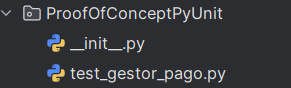
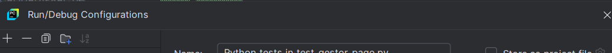
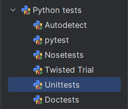
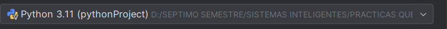
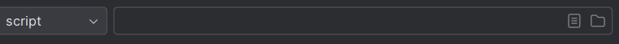
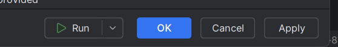
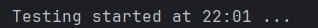
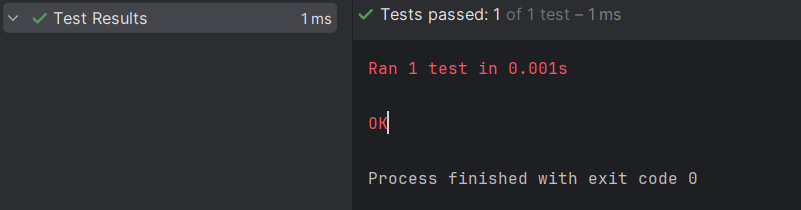

Se adjunta un problema pequeño resuelto de nuestro proyecto testeado con PyUnit los pasos son los siguientes:

1. Definirse un archivo de pruebas en un modulo apartado del código central de nuestro programa, el modulo por conveniencia se debería llamar como el modulo que estemos testeando, pero para este ejercicio se llamara ProofOfConceptPyUnit, los archivos de test deben llamarse por conveniencia:
test_nombre_del_archivo.py, donde nombre_del_archivo es el nombre del archivo punto py especifico que estamos testeando

notemos que deberemos crear un archivo __ init __.py en nuestro modulo de testeo si es que pycharm no nos lo crea.

2. Escribir el código en el archivo. py que creamos

from Modelo.G_pago.GestorPago import GestorPago
import unittest

class TestGestorPago(unittest.TestCase):

    def setUp(self):
        self.gestor_pago = GestorPago()

    def test_validar_datos(self):
        self.assertTrue(self.gestor_pago.validar_datos("1234567812345678", "12/23", "123"))
        self.assertFalse(self.gestor_pago.validar_datos("12345678", "12/23", "123"))
        self.assertFalse(self.gestor_pago.validar_datos("1234567812345678", "12/2023", "123"))
        self.assertFalse(self.gestor_pago.validar_datos("1234567812345678", "12/23", "12"))

    def tearDown(self):
        del self.gestor_pago

1. No necesitamos instalar ninguna librería extra basta con que escribamos import unittest y heredemos el TestCase de este modulo a nuestra clase para aprovechar de todas las funcionalidades que nos ofrece PyUnit

2. Además PyUnit tiene la flexibilidad de poder escribir literalmente nuestros setUps y tearDowns como se observa en el codigo proporcionado

3. La cantidad de asserts y su gran variedad son suficientes para proyectos grandes

Finalmente para hacer correr el código debemos aprovecharnos de nuestro IDE con los siguientes pasos:

Se debe configurar nuestra sección llamada Run/Debug:

Específicamente ajustaremos la flecha que apunta hacia abajo

Se nos desplegara la siguiente pantalla:

Ajustaremos en el simbolo +

Luego ajustaremos en:

Luego seleccionaremos el intereprete de Python que queremos que ejecute las pruebas buscando el archivo donde esta nuestro python y guardándolo en:

Luego seleccionaremos un archivo sobre el cual se ejecutara el Run/Debug es decir nuestro archivo de pruebas:

Finalmente aplicaremos los cambios con Apply y le daremos a Ok

Esos son todos los pasos ahora puedes correr todo tu conjunto de pruebas de PyUnit ajustando un solo boton:

Obtendremos salidas como la siguiente:

